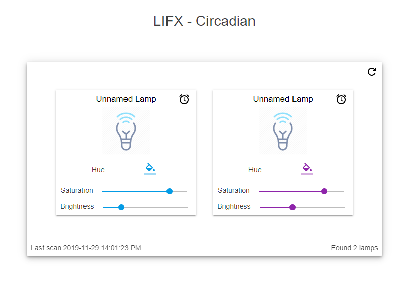

# lifx-circadian
Small python script to control on/off for LIFX lamps using the LAN protocol. The LIFX application has support for configuring day/nighttime cycles but does only support monophasic sleep, how traditional.

More information on alternatives to monophasic sleep here: [polyphasic.net](https://polyphasic.net/)



_Web interface in progress._

### Installation

Requires python 3.6.3+ for asyncio.

```console
pip install aiocron, lifxlan, pyyaml
python main.py
```

### Configuration

This is the sample configuration

```yaml

---  
lamps:
    - name: "Candy"
      schema:
          - power: False
            transition: 180
            cron: "25 21 * * * 0"
          - power: True
            transition: 60
            cron: "15 1 * * * 0"
          - power: False
            transition: 180
            cron: "45 3 * * * 0"
          - power: True
            transition: 60
            cron: "40 7 * * * 0"
    - name: "LIFX Flory"
      schema:
          - power: True
            brightness: 0.5
            saturation: 1.0
            transition: 60
            hue: 299
            cron: "49 19 * * * 0""
```

Replace `lamp #1` with the label/name of the discovered lamps.

Lamps will start to power up/down when the expression triggers over time, as defined by the fade configuration.
